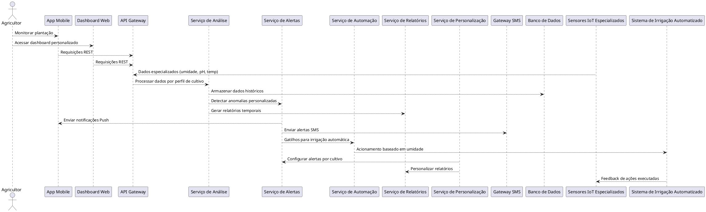
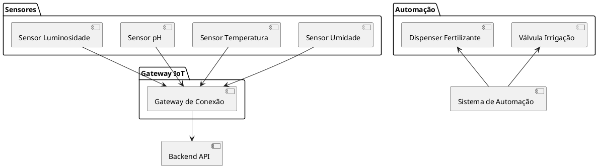

# Sistema de Monitoramento Agrícola IoT - Iteração 2

# 1. Visão Geral do Sistema

### Propósito do sistema
O **Sistema de Monitoramento Agrícola IoT** consiste em uma plataforma tecnológica integrada que visa facilitar o manejo agrícola através da coleta, análise e automação baseada em dados obtidos através de sensores. 
O sistema deve combinar sensores distribuídos no campo, processamento inteligente de dados e interfaces para proporcionar aos agricultores controle de suas plantações, de maneira a otimizar recursos e aumentar a produtividade.

---

### Principais funcionalidades

#### **Iteração 1**
- **Análise Inteligente de Dados do Solo**  
O sistema coleta dados de sensores distribuídos estrategicamente pela plantação, medindo parâmetros como pH, umidade, nutrientes, temperatura, entre outros. Esses dados são processados por algoritmos de análise que permitem aos usuários tomar melhores decisões sobre o manejo.

- **Automação de Processos Agrícolas**  
Através dos dispositivos IoT conectados, o sistema automatiza processos críticos como irrigação, fertilização e monitoramento de colheitas.

- **Sistema de Alertas e Detecção de Anomalias**  
O sistema vai monitorar continuamente todos os parâmetros coletados e identificar automaticamente situações que requerem atenção. Alertas são enviados de maneira imediata por meio de canais.

- **Notificações Mobile em Tempo Real**  
Uma aplicação mobile permite que os usuários recebam notificações push sobre condições da plantação, incluindo alertas e status dos equipamentos, para informar o agricultor mesmo distante do campo.

- **Visualizações Interativas e Dashboards**  
O sistema oferece interfaces web e mobile com mapas interativos, gráficos dinâmicos e dashboards que exibem os dados coletados.

#### **Iteração 2**
- **Sistema de Relatórios Temporais**  
O sistema gera relatórios detalhados sobre as condições ambientais em períodos específicos, permitindo análise histórica e identificação de tendências para otimização do cuidado agrícola.

- **Coleta Especializada de Dados do Solo**  
Implementação de sensores para coleta de dados críticos do solo incluindo umidade, pH e temperatura, com calibração automática e validação de dados para garantir precisão das medições.

- **Automação Inteligente de Irrigação**  
Sistema automatizado que aciona o sistema de irrigação quando os níveis de umidade do solo estão abaixo dos parâmetros ideais configurados, considerando o tipo de cultivo, fase de desenvolvimento e condições climáticas.

- **Alertas Multi-canal Personalizados**  
Envio de alertas via aplicativo móvel e SMS quando níveis críticos são detectados, com definição inteligente baseada na criticidade da situação e disponibilidade do usuário.

- **Personalização Avançada por Perfil de Cultivo**  
Configurações que permitem personalizar alertas, relatórios e automações conforme o tipo de cultivo, fase de desenvolvimento da planta e perfil do usuário, incluindo preferências de manejo e objetivos de produção.

---

### Benefícios esperados

#### Aumento de produtividade e qualidade do cultivo:
- Otimização do uso de recursos através de dados precisos e históricos
- Detecção precoce de problemas que podem afetar a produção
- Automação inteligente de processos manuais baseada em perfis de cultivo
- Melhoria na qualidade e uniformidade dos cultivos através de monitoramento especializado

#### Economia de Recursos
- Redução significativa do consumo de água através de irrigação automatizada
- Uso eficiente de fertilizantes baseado em análise precisa e histórica do solo
- Diminuição de custos operacionais através da automação personalizada
- Prevenção de perdas por detecção e resposta automática a problemas

#### Tomada de Decisão Baseada em Dados
- Acesso a dados históricos e relatórios para guiar o planejamento
- Insights sobre condições futuras da plantação
- Relatórios personalizados por tipo de cultivo e fase de desenvolvimento
- Análise comparativa entre diferentes períodos e práticas de manejo

#### Sustentabilidade Ambiental
- Redução do desperdício de recursos naturais através de automação inteligente
- Minimização do uso excessivo de químicos baseado em dados precisos
- Monitoramento contínuo do impacto ambiental das práticas agrícolas
- Promoção de agricultura de precisão personalizada por cultivo

---

### Escopo

#### **O que o Sistema FAZ:**
- Coleta dados especializados de sensores distribuídos na plantação (umidade, pH, temperatura)
- Processa e analisa dados em tempo real com algoritmos personalizados
- Gera alertas automáticos multi-canal (mobile, SMS) para situações críticas
- Controla automaticamente dispositivos de irrigação baseado em parâmetros ideais
- Fornece interfaces web e mobile personalizáveis para monitoramento
- Armazena histórico de dados e gera relatórios detalhados
- Gera visualizações interativas e dashboards adaptados ao perfil do usuário
- Envia notificações push e SMS personalizadas por tipo de cultivo
- Permite configuração de alertas por fase de desenvolvimento da planta
- Oferece automação personalizada conforme perfil do agricultor

#### **O que o Sistema NÃO FAZ:**
- Não substitui completamente a supervisão e conhecimento agronômico humano
- Não inclui instalação física dos sensores e equipamentos de campo
- Não oferece consultoria agronômica especializada ou recomendações de cultivo
- Não controla equipamentos de terceiros incompatíveis
- Não garante resultados específicos de produtividade ou rendimento
- Não inclui manutenção física preventiva ou corretiva dos dispositivos IoT
- Não realiza análises laboratoriais físico-químicas do solo
- Não substitui práticas agronômicas estabelecidas sem validação técnica

---

### Limitações Técnicas
- Dependência de conectividade de rede estável para funcionamento completo 
- Necessidade de calibração periódica dos sensores para manter precisão dos dados
- Performance diretamente limitada pela qualidade e confiabilidade dos dados dos sensores
- Cobertura de monitoramento limitada pela distribuição física estratégica dos dispositivos
- Personalização limitada aos parâmetros configuráveis definidos no sistema
- Relatórios temporais dependentes do histórico de dados disponível na base
- Automação de irrigação depende das condições de infraestrutura hidráulica do terreno

---

###  Diagrama de Arquitetura Geral Completo
[](https://editor.plantuml.com/uml/ZLLBRjim4DqRy1tOh5eWHXP5Dq8H96tSr8i0HXoWwp4vZWUHI9QaaZQt2Rh80OgUG1Vha9HbIIqCxqZflVcyUIDT-00kr5KvdRmXBSjQeVWOQWlAlJ_R61rcy8JUL3ZxS5PxTFxy261brbJYCKY5_Y4OUmnKbgPMHyM406lmCVzq0Z8O9qukxnt9kkJpYG0lOYVJYUNEIP857HXXhRX9TIT4Rc64kGA_NHjmIdp3TO8zuNeSPxaGrn3m2Nuc15WQ8LRe7gbvDO9xkDJDIqa-vmGDyNm8Ng8Bu3Cwdm-Xws0gQ5wRNoOpqbs2ES2vnH92yzkHoLbSl9juFK1QiYzCBFwvbytk7_wRibL8h6vM2UohSVnFe6KAVWMghKMDjLwXziQX5mjp9-RUegIKRqVmxVinZNp02cBmXNDqdujkvGg9d-YKNgRYfvDe6J6RdRVEADWicbWPSCAM73O7wU7O6eMubEWzGrJdd9uiYk4vMYAmKmhM_tjDdeLj_d1Vj_FLtNJ2aGu3TdtkKKaqWGD9nDkw8WKAJuNzUYfO0lkE5yHIfcNp5MBfJ5TqP5dU7ovwGsKKB2uHFNBXBJvnLUpKLV2CkgDjMUJe8ncTqmUtlkKQCQ3ahm-dPjrB6df6mOYtTs8XhZ7gxlPUJTtmC2YISeB1iERwaPYXJQ0DIMZLMzP-EyIp3plmxZbxT0ZgzgY8cqxbDge43bh3P3SbKFF2hWDcxnY9t_ag-eEutmfrC29-irWwWPLe1yM-7IpHKB_FHc_eldQzKkEikWdzXzlNiBUq0ocdaww-B4bhha9yGLHha0_H1pi9yGVAEkHfNQ1M_2Vv2m00)

### Diagrama de Componentes Completo
[![](https://img.plantuml.biz/plantuml/svg/VLPBRjim4DqRy1s8hDf5hb0aSVfn4HT9dAABfWX64kqGfKILf99-qCC4NUG0HK_WYtKu92LISW8lJCrxGytdpTX7neAsNItdinRAhx3bx601DLJ0AiwEMyqDRopi7dT_r07xDPynzlaKp6sXG5Vi4o_OETT6DI35JwZK5mQ6tVE2UCUj52LOSQVOIXL2Sa9hEdh2-PAz1SlluGT1MtycRDbOhZTGSXV79PTWTt-rK8Q8chTAMtFJYVdiztosD_OrrtTYzwXC33iQAB5czo25eSjFCMv_BRWq33TJkkJQ8c7LIIiEIyVp3ju-vNTMrRvep2KYnHQhwFC7mafG4wyFoeeDLWpz_d4VKHDCfTeJrKVJxHxwcdG66p7X99LZLxp6ie68DKH4EM3YbBIKSY1-EnXZyA5tRBrQ4yNKvgRluLDzeNB7dfn0KoeAiXJkyklcnRaoTglv-kBiPOopAXBobQYfkO8RP2-RZUo-dvvuhaKia1TGthhqgv1kwPu9UOFoOsjC7GFpOVjpyWuCSw6QZTXsEdJZkabr3k5EujouD-xDTgcks6lJyb84jq6AZL4uMjJ5MbI0tvLYQoLzhKt0RpeFJfpQT_lvxUs4whhEDLXC9UTQ17BsGefwzs156IJLKqi4m7E5GJzgv59hiGqYzuAtmmuG1FOg7xpUuCI8N5cRQ1hh2kldBrFsALrX_pLmOtNd4eprFLDGiHEGs4okwGhfLR7YnZY_Yuvt7ELp2KKXxEh2o-URitgUQeGRZcORTXOz-bnGHrM7Wu_k2wqQzbuLnlkR28KeSH6omyDNmrxpko-t3RiijuS36OV5b5dZzicCmtf9pM4xfAPq0QJsyQ3FP_7r1CSPounXka94PCfNLufaQo85Gltx558Z9H3ZTk_Fm_HH3FCu99S5FJBtavy6IqZybKfYpMkEq6X82S-acepbCw2RmsTWchqfdZpakichbynX3kH3Dvz9BrNwxGxdM0Fgm5XSOIH6yioiiLJzM4naboF9xIDvzNqQLD2RHYrDDB178K4xHxofw3-F-_m7)](https://editor.plantuml.com/uml/VLPBRjim4DqRy1s8hDf5hb0aSVfn4HT9dAABfWX64kqGfKILf99-qCC4NUG0HK_WYtKu92LISW8lJCrxGytdpTX7neAsNItdinRAhx3bx601DLJ0AiwEMyqDRopi7dT_r07xDPynzlaKp6sXG5Vi4o_OETT6DI35JwZK5mQ6tVE2UCUj52LOSQVOIXL2Sa9hEdh2-PAz1SlluGT1MtycRDbOhZTGSXV79PTWTt-rK8Q8chTAMtFJYVdiztosD_OrrtTYzwXC33iQAB5czo25eSjFCMv_BRWq33TJkkJQ8c7LIIiEIyVp3ju-vNTMrRvep2KYnHQhwFC7mafG4wyFoeeDLWpz_d4VKHDCfTeJrKVJxHxwcdG66p7X99LZLxp6ie68DKH4EM3YbBIKSY1-EnXZyA5tRBrQ4yNKvgRluLDzeNB7dfn0KoeAiXJkyklcnRaoTglv-kBiPOopAXBobQYfkO8RP2-RZUo-dvvuhaKia1TGthhqgv1kwPu9UOFoOsjC7GFpOVjpyWuCSw6QZTXsEdJZkabr3k5EujouD-xDTgcks6lJyb84jq6AZL4uMjJ5MbI0tvLYQoLzhKt0RpeFJfpQT_lvxUs4whhEDLXC9UTQ17BsGefwzs156IJLKqi4m7E5GJzgv59hiGqYzuAtmmuG1FOg7xpUuCI8N5cRQ1hh2kldBrFsALrX_pLmOtNd4eprFLDGiHEGs4okwGhfLR7YnZY_Yuvt7ELp2KKXxEh2o-URitgUQeGRZcORTXOz-bnGHrM7Wu_k2wqQzbuLnlkR28KeSH6omyDNmrxpko-t3RiijuS36OV5b5dZzicCmtf9pM4xfAPq0QJsyQ3FP_7r1CSPounXka94PCfNLufaQo85Gltx558Z9H3ZTk_Fm_HH3FCu99S5FJBtavy6IqZybKfYpMkEq6X82S-acepbCw2RmsTWchqfdZpakichbynX3kH3Dvz9BrNwxGxdM0Fgm5XSOIH6yioiiLJzM4naboF9xIDvzNqQLD2RHYrDDB178K4xHxofw3-F-_m7)

## 2. Arquitetura de Sensores e IoT

### Tipos de Sensores

Os sensores são responsáveis por coletar dados fundamentais do solo e ambiente para análise e tomada de decisão. O sistema deve incorporar os seguintes sensores:

- **Umidade do solo**
- **Temperatura do solo e ambiente**
- **pH do solo**
- **Luminosidade**

---

### Dispositivos de Automação

O sistema contará com dispositivos IoT responsáveis por executar ações automáticas com base nas análises realizadas:

- **Válvulas de irrigação automatizadas**
- **Dispensadores de fertilizante**

---

### Conectividade

A arquitetura de comunicação deve ser adaptável ao ambiente agrícola, com suporte para tecnologias de longo alcance e baixo consumo:

- **Wi-Fi**
- **LoRa**
- **Zigbee com gateways IoT**

---

### Localização e Distribuição

Os sensores devem ser distribuídos estrategicamente no campo de acordo com o tipo de cultura, solo e necessidades da plantação, garantindo cobertura representativa:

- Utilização de mapas interativos para visualização da posição dos sensores.
- Possibilidade de personalizar a densidade de sensores conforme o cultivo.

---

### Diagrama PlantUML - Arquitetura IoT

## 3. Backend e Processamento

### Arquitetura de Dados

- Banco de Dados Relacional (PostgreSQL): Armazenar dados estruturados (usuários, dispositivos, logs de ações, perfis personalizados de cultivo e configurações de alertas).
- Banco de Dados NoSQL (MongoDB ou InfluxDB): Armazenar grandes volumes de dados temporais dos sensores com alta taxa de escrita (umidade, temperatura, pH).
- Data Lake ou Armazenamento em Nuvem (AWS S3 / Azure Blob Storage): Arquivamento e análise histórica em larga escala, incluindo dados para geração de relatórios e modelos preditivos.

---

### APIs e Microserviços

- Serviço de Sensoriamento: recebe e armazena dados dos sensores (umidade, pH, temperatura).
- Serviço de Análise de Dados: realiza o processamento e análise em batch ou em tempo real, incluindo análise por cultura e fase da planta.
- Serviço de Alertas: identifica anomalias ou limiares definidos e dispara notificações personalizadas.
- Serviço de Automação IoT: interage com dispositivos IoT para executar ações automatizadas, como ativar a irrigação quando a umidade estiver abaixo do ideal.
- Serviço de Relatórios: gera relatórios com dados históricos por período, adaptados ao tipo de cultivo e fase da planta.
- Serviço de Personalização: permite que o usuário configure alertas, limites e relatórios conforme o tipo de cultivo e perfil do usuário.
- Serviço de Autenticação e Gerenciamento de Usuários: controle de acesso e identidade.
- Gateway de API: gerencia as requisições de entrada e direciona aos microserviços adequados.

---

### Sistema de Análise

- Análise Estatística: médias, desvio padrão, tendências, comparações com valores ideais por tipo de cultivo.
- Detecção de Anomalias: com base em regras ou algoritmos de aprendizado de máquina (ex: Floresta de Isolamento).
- Módulo de Previsão (opcional): prever condições futuras da plantação com base em séries temporais e históricos de cultivo.
- Módulo de Suporte à Decisão (opcional): recomendações automáticas baseadas em tipo de solo, clima e fase da planta.

Ferramentas como **Python com Pandas, Scikit-learn, TensorFlow** ou frameworks como **Apache Spark** podem ser utilizadas.

---

### Sistema de Alertas

Os alertas podem ser configurados com base em:

- Limiares (ex: temperatura > 40°C ou umidade < 30%) definidos pelo usuário.
- Padrões anômalos identificados por IA.
- Falta de leitura dos sensores (possível falha ou desconexão).
- Fase da planta ou tipo de cultivo (ex: alertas mais sensíveis para mudas).

As notificações podem ser enviadas por:

- Push notifications (via Firebase Cloud Messaging).
- E-mails ou SMS (ex: via Twilio ou AWS SNS).
- Dashboards em tempo real (com interface web ou app móvel).

---

### Sistema de Relatórios

- Geração automática ou sob demanda de relatórios por período (diário, semanal, mensal).
- Visualização de dados históricos por sensor e por tipo de cultivo.
- Gráficos de variação de umidade, temperatura e pH.
- Resumo de alertas emitidos e ações realizadas (como ativações de irrigação).
- Exportação dos relatórios em **PDF ou CSV**.
- Acesso aos relatórios via dashboard web ou aplicativo móvel.

---

### Tecnologias sugeridas

| Componente                     | Tecnologia Sugerida                          |
|-------------------------------|----------------------------------------------|
| Backend Principal             | Node.js, Python (FastAPI), Java (Spring Boot)|
| Banco Relacional              | PostgreSQL                                   |
| Banco de Dados Temporal       | InfluxDB, MongoDB                            |
| Mensageria IoT                | MQTT (Mosquitto), Kafka                      |
| APIs                          | RESTful APIs, WebSockets                     |
| Análise de Dados              | Python (Pandas, Scikit-learn), Apache Spark  |
| Orquestração de Serviços      | Docker, Kubernetes                           |
| Notificações Push             | Firebase Cloud Messaging (FCM)               |
| Envio de SMS                  | Twilio, AWS SNS                              |
| Relatórios                    | Apache PDFBox, JasperReports, Pandas (PDF/CSV)|
| Dashboards                    | Grafana, Kibana, ou WebApp (React/Angular)   |
| Automação IoT                 | Node-RED, MQTT Brokers, AWS IoT Core         |

---

## 4. Interface e Visualização

A interface do usuário (UI) e a visualização de dados são componentes críticos para o Sistema de Monitoramento Agrícola IoT, pois são o principal meio pelo qual os agricultores interagem e extraem valor da plataforma. A UI deve ser intuitiva, informativa e permitir ações rápidas e eficazes, atendendo diretamente aos requisitos de visualização de dados, controle de irrigação e personalização de alertas.

### Dashboard Web Principal

O Dashboard Web Principal é o ponto central de acesso para o usuário, oferecendo uma visão geral e consolidada do estado da plantação.

- **Propósito:** Fornecer um resumo visual e rápido das condições atuais da lavoura, alertas pendentes e atalhos para as funcionalidades mais importantes, cumprindo o requisito de exibir relatórios sobre as condições do ambiente em um determinado período (visão em tempo real do período atual).

- **Conteúdo Chave:**
  - **Widgets de Status:** Exibição em tempo real dos principais parâmetros monitorados (umidade, pH e temperatura do solo, bem como temperatura ambiente, níveis de reservatórios de água/fertilizantes), atendendo diretamente ao requisito de coletar dados do solo.
  - **Resumo de Alertas:** Notificações de anomalias recentes ou alertas críticos que exigem atenção imediata, como níveis de umidade do solo abaixo do limite, suprindo o requisito de enviar alertas automáticos para o agricultor.
  - **Atalhos para Automação:** Acesso rápido para iniciar ou parar ciclos de irrigação ou fertilização, relacionado ao requisito de acionar automaticamente o sistema de irrigação, mas também permitindo controle manual.
  - **Mini-mapa da Propriedade:** Uma visão geral da localização dos sensores e status resumido por zona (se aplicável).
  - **Gráficos de Tendência Rápida:** Pequenos gráficos mostrando a evolução recente de 1-2 indicadores chave (ex.: umidade nas últimas 24h).

- **Qualidades:**
  - **Clareza:** Informações apresentadas de forma direta e fácil de entender.
  - **Priorização:** Destaque para dados e alertas mais relevantes.
  - **Customização (Desejável):** Possibilidade de o usuário personalizar quais widgets são exibidos ou sua ordem, contribuindo para o requisito de personalização de alertas e relatórios.

---

### Mapas e Geolocalização

A funcionalidade de mapas e geolocalização permite uma compreensão espacial dos dados coletados, aprimorando a visualização das condições do ambiente e a distribuição dos dados coletados do solo.

- **Propósito:** Visualizar a distribuição dos sensores no campo, as leituras de cada sensor em seu local exato e a variação espacial das condições da lavoura, oferecendo uma representação geográfica dos dados de umidade, pH e temperatura.

- **Funcionalidades:**
  - **Visualização de Sensores:** Ícones no mapa indicando a localização de cada sensor, com a possibilidade de clicar para ver dados detalhados.
  - **Heatmaps (Mapas de Calor):** Representação visual da variação de parâmetros como umidade do solo, pH, temperatura ou níveis de nutrientes em toda a área da plantação.
  - **Delimitação de Zonas/Talhões:** Permitir que o usuário desenhe ou importe polígonos representando diferentes talhões ou zonas de manejo.
  - **Navegação e Zoom:** Ferramentas padrão de mapa para fácil navegação.

- **Qualidades:**
  - **Precisão:** Representação fiel da localização dos dispositivos.
  - **Interatividade:** Resposta rápida a cliques e seleções, com tooltips informativos.
  - **Performance:** Carregamento eficiente mesmo com muitos pontos de dados ou grandes áreas.

---

### Gráficos e Relatórios

Gráficos e relatórios são essenciais para a análise de tendências, comparação de dados históricos e tomada de decisão baseada em evidências.

- **Propósito:** Transformar dados brutos dos sensores em insights acionáveis através de representações visuais e sumários estruturados.

- **Tipos de Gráficos:**
  - **Gráficos de Linha:** Para visualizar tendências temporais.
  - **Gráficos de Barra:** Para comparar valores entre sensores, zonas ou períodos.
  - **Gráficos de Pizza/Rosca:** Para mostrar proporções (ex.: status dos dispositivos).
  - **Dispersão (Scatter Plots):** Para identificar correlações entre variáveis.

- **Funcionalidades de Relatórios:**
  - **Relatórios Históricos Personalizáveis:** Por período (diário, semanal, mensal) e por perfil do usuário.
  - **Relatórios de Consumo:** Uso de água e fertilizantes.
  - **Relatórios de Alertas:** Histórico de alertas, causas e resoluções.
  - **Exportação:** Gráficos (imagem) e dados (CSV, PDF).

- **Qualidades:**
  - **Interatividade:** Filtros dinâmicos, zoom e tooltips.
  - **Legibilidade:** Eixos claros, legendas descritivas, cores contrastantes.
  - **Customização:** Seleção de dados específicos para gráficos e relatórios.

---

### Interface de Controle

Permite aos usuários gerenciar dispositivos de automação e configurações do sistema.

- **Propósito:** Dar ao agricultor o controle sobre operações automatizadas e configurações dos dispositivos e alertas.

- **Funcionalidades:**
  - **Controle de Atuadores:** Ligar/desligar válvulas, dispensadores, etc.
  - **Agendamento de Tarefas:** Programar ciclos de irrigação/fertilização.
  - **Configuração de Limiares de Alerta:** Definir limites de umidade, pH, etc.
  - **Gerenciamento de Dispositivos:** Monitorar status e configurar dispositivos IoT.
  - **Configuração de Notificações:** Escolher como receber alertas (app, SMS).

- **Qualidades:**
  - **Feedback Imediato:** Confirmações visuais de comandos enviados.
  - **Segurança:** Confirmação para ações críticas.
  - **Intuitividade:** Controles claros e fáceis de usar.

---

### Responsividade

A interface deve ser funcional em diferentes dispositivos e tamanhos de tela.

- **Propósito:** Garantir boa experiência tanto em desktops quanto em dispositivos móveis.

- **Considerações:**
  - **Layout Fluido:** Adaptação automática ao tamanho da tela.
  - **Design Mobile-First:** Foco na experiência móvel.
  - **Touch-Friendly:** Botões grandes para fácil uso em telas sensíveis ao toque.

- **Qualidades:**
  - **Consistência:** Experiência similar em diferentes dispositivos.
  - **Acessibilidade:** Navegação intuitiva em qualquer tela.
  - **Performance:** Carregamento rápido, mesmo em redes móveis.

---

### Tecnologias Sugeridas

| Categoria                      | Tecnologia/Biblioteca | Descrição                                                                 |
| ------------------------------ | ---------------------- | ------------------------------------------------------------------------- |
| **Frontend Frameworks**        | React.js              | Ecossistema robusto, ideal para SPAs e dashboards interativos.           |
|                                | Angular               | Framework completo, bom para aplicações enterprise.                      |
|                                | Vue.js                | Curva de aprendizado suave, ótimo para projetos menores ou incrementais. |
| **Bibliotecas de Gráficos**    | Chart.js              | Leve, boa variedade de gráficos básicos.                                 |
|                                | D3.js                 | Poderosa, para visualizações complexas.                                  |
|                                | ECharts               | Gráficos ricos, interativos.                                             |
|                                | ApexCharts            | Gráficos SVG modernos e responsivos.                                     |
| **Bibliotecas de Mapas**       | Leaflet               | Leve e open-source para mapas interativos.                               |
|                                | OpenLayers            | Mais robusto que Leaflet.                                                |
|                                | Mapbox GL JS          | Mapas de alta performance (pode ter custos).                             |
| **State Management (SPAs)**    | Redux (React)         | Gerenciamento de estado para React.                                      |
|                                | Vuex (Vue)            | Gerenciamento de estado para Vue.                                        |
|                                | NgRx (Angular)        | Gerenciamento de estado para Angular.                                    |
| **UI Component Libraries**     | Material-UI (React)   | Componentes com Material Design.                                         |
|                                | Ant Design            | UI rica para React, Vue ou Angular.                                      |
|                                | Bootstrap             | Framework clássico para UI responsiva.                                   |
| **Ferramentas de Build**       | Webpack               | Empacotador de módulos JavaScript.                                       |
|                                | Vite                  | Build moderno, rápido e com HMR.                                         |

---

### Decisões de Arquitetura para Interface e Visualização

- **API First:** A interface depende de uma API robusta (REST ou WebSockets) para buscar dados e enviar comandos.
- **Separação de Interesses:** Frontend separado do backend, promovendo modularidade.
- **Componentização:** UI baseada em componentes reutilizáveis, facilitando manutenção e escalabilidade.
- **Performance:** Otimização de carregamento, uso de lazy loading, paginação e virtualização.
- **Experiência do Usuário (UX):** Design centrado no usuário, com testes de usabilidade e foco em personalização de alertas e relatórios.
- **Atualizações em Tempo Real:** Uso de WebSockets ou Server-Sent Events (SSE) para dados críticos e alertas.
- **Integração com Serviços de Notificação:** Notificações via SMS e push para aplicativos móveis, garantindo comunicação rápida e eficaz com o agricultor.

## 5. Sistema Mobile e Notificações

### Aplicativo Mobile

O aplicativo mobile é a principal interface para agricultores **monitorarem**, **analisarem** e **controlarem remotamente** suas plantações. Agora com foco nos **dez requisitos funcionais definidos**, o app oferece uma plataforma robusta que integra sensores IoT, análise ambiental, automação agrícola e comunicação proativa com o usuário, facilitando a tomada de decisões no campo.

**Principais Funcionalidades:**

- **Monitoramento em Tempo Real:**
  - Visualização contínua dos dados captados por sensores (temperatura, umidade, pH do solo, condutividade, etc.)
  - Gráficos e dashboards interativos atualizados dinamicamente

- **Automação Agrícola Baseada em Regras:**
  - Controle automático e manual de irrigação, fertilização e colheita
  - Execução automática de comandos com base em condições do solo (ex: iniciar irrigação se umidade < limite ideal)

- **Alertas Inteligentes e Personalizados:**
  - Detecção de anomalias com disparo automático de alertas
  - Notificações configuráveis por tipo de cultura, estágio da planta e preferências do usuário
  - Envio de alertas críticos por **push notification** e/ou **SMS**

- **Análise Avançada dos Dados Ambientais:**
  - Processamento de dados dos sensores com geração de insights
  - Identificação de padrões (ex: queda persistente da umidade em determinada área)
  - Diagnóstico de zonas da plantação com necessidades específicas

- **Visualizações Geográficas e Interativas:**
  - Mapa da plantação com sensores geolocalizados e indicadores por setor
  - Interface visual intuitiva para acompanhamento de status e alertas

- **Histórico e Relatórios Customizáveis:**
  - Registro e acesso a históricos de leituras ambientais, alertas e ações automatizadas
  - Geração de relatórios diários, semanais ou mensais, adaptados ao tipo de cultivo e perfil do usuário

- **Modo Offline:**
  - Armazenamento local de dados por até 24h em caso de perda de conectividade
  - Sincronização automática com o backend assim que restabelecida a conexão

---

### Sistema de Notificações Push e SMS

**Funcionalidades-Chave:**

- **Tipos de Alerta:**
  - Anomalias críticas (ex: "Umidade abaixo de 20% na Zona A")
  - Condições fora do padrão (ex: pH do solo em níveis ácidos)
  - Status de dispositivos IoT (ex: falha de sensor, bateria baixa)
  - Ações automáticas executadas (ex: "Irrigação iniciada automaticamente")

- **Canais de Envio:**
  - Push Notifications (via FCM)
  - Envio por SMS em casos de urgência ou áreas com baixa conectividade

- **Personalização Avançada:**
  - Definição de regras e condições para disparo de alertas
  - Horários de silêncio e filtros por tipo de notificação
  - Perfis de alerta baseados no tipo de cultura e fase de crescimento

---

### Integração com Backend

**Fluxo de Comunicação:**

- **Autenticação Segura:**
  - Login via API Gateway com tokens JWT

- **Principais Endpoints:**
  - `GET /sensors/current` – Dados atuais do ambiente
  - `POST /automation/trigger` – Disparo de ações automáticas/manuais
  - `GET /alerts/history` – Histórico completo de alertas e ações
  - `GET /reports` – Relatórios filtrados por cultivo, área e período

- **Sincronização e Resiliência:**
  - Persistência local via `SQLite`
  - Estratégia de `optimistic UI` com sincronização assíncrona

---

### Funcionalidades Exclusivas do App

- **Geofencing Agrícola:**
  - Recebimento de alertas ao entrar/sair de áreas específicas da plantação

- **Upload de Evidências Visuais:**
  - Envio de imagens junto a alertas (ex: pragas, danos por clima)

- **Assistente de Voz:**
  - Comandos por voz com integração ao Google Assistant ou Siri

- **Conectividade Local Bluetooth:**
  - Operação offline com dispositivos IoT próximos via BLE

---

### Experiência do Usuário

**Diretrizes de Design:**

- **Foco nas Informações Críticas:**
  - Indicadores de anomalias e status visíveis de forma destacada

- **Navegação Intuitiva:**
  - Menu fixo com abas "Monitoramento", "Ações", "Alertas" e "Relatórios"

- **Resposta Imediata:**
  - Cores e vibrações configuráveis para alertas de alta prioridade

- **Acessibilidade Total:**
  - Compatibilidade com leitores de tela, modo noturno e contraste alto

---

### Tecnologias Sugeridas

| Componente               | Tecnologia                             | Descrição                                                                                     |
|--------------------------|-----------------------------------------|-----------------------------------------------------------------------------------------------|
| Desenvolvimento          | React Native ou Flutter                 | Frameworks multiplataforma com boa performance em apps IoT                                    |
| Notificações             | Firebase Cloud Messaging (FCM) + SMS API (ex: Twilio) | Notificações móveis e por SMS para garantir alcance mesmo sem internet                       |
| Armazenamento Local      | SQLite                                  | Base local para persistência offline dos dados                                                |
| Visualizações e Mapas    | Mapbox SDK                              | Visualização de sensores e dados por setor geográfico                                         |
| Backend/Sync             | REST API + WebSockets                   | Comunicação contínua e eficiente com o servidor                                               |
| Segurança                | OAuth2 + SSL Pinning                    | Garantia de integridade e segurança na comunicação                                            |

## 6. Diagramas Arquiteturais

### Diagrama de Arquitetura Geral

### Diagrama de Componentes

```plantuml
@startuml
package "Camada de Apresentação" {
  [Dashboard Web Personalizado] as web
  [Aplicativo Mobile] as mobile
  [API Gateway] as gateway
  [Interface de Relatórios] as reports_ui
}

package "Camada de Serviços" {
  [Serviço de Análise de Dados] as analises
  [Serviço de Alertas Multi-canal] as alertas
  [Serviço de Automação Inteligente] as automacao
  [Serviço de Notificações] as notificacoes
  [Serviço de Usuários] as users
  [Serviço de Relatórios Temporais] as relatorios
  [Serviço de Personalização] as personalizacao
  [Gateway SMS] as sms_gateway
}

package "Camada de Dados" {
  [Banco Relacional\n(PostgreSQL)] as reldb
  [Banco Time Series\n(InfluxDB)] as timedb
  [Cache Redis] as cache
  [File Storage] as storage
  [Banco de Configurações\nPersonalizadas] as config_db
}

package "Camada IoT Especializada" {
  [Sensores de Umidade do Solo] as sensores_umidade
  [Sensores de pH do Solo] as sensores_ph
  [Sensores de Temperatura] as sensores_temp
  [Sensores Climáticos] as sensores_clima
  [Sistema de Irrigação Automatizado] as irrigacao
  [Sistema de Fertilização] as fertilizacao
  [Gateway IoT] as iot_gateway
}

package "Infraestrutura" {
  [Load Balancer] as lb
  [Message Queue\n(RabbitMQ)] as queue
  [Monitoring] as monitor
  [Scheduler\n(Cron Jobs)] as scheduler
}

web --> gateway
mobile --> gateway
reports_ui --> gateway
gateway --> analises
gateway --> alertas
gateway --> automacao
gateway --> users
gateway --> relatorios
gateway --> personalizacao

analises --> timedb
analises --> cache
alertas --> notificacoes
alertas --> sms_gateway
alertas --> queue
automacao --> queue
users --> reldb
personalizacao --> config_db
relatorios --> timedb
relatorios --> storage
notificacoes --> mobile
sms_gateway --> alertas

sensores_umidade --> iot_gateway
sensores_ph --> iot_gateway
sensores_temp --> iot_gateway
sensores_clima --> iot_gateway
iot_gateway --> gateway
automacao --> irrigacao
automacao --> fertilizacao

lb --> web
lb --> mobile
queue --> automacao
monitor --> analises
monitor --> alertas
scheduler --> relatorios
scheduler --> automacao

analises --> storage
users --> storage
relatorios --> config_db
personalizacao --> reldb
@enduml
```

### Diagrama de Sensores e IoT

