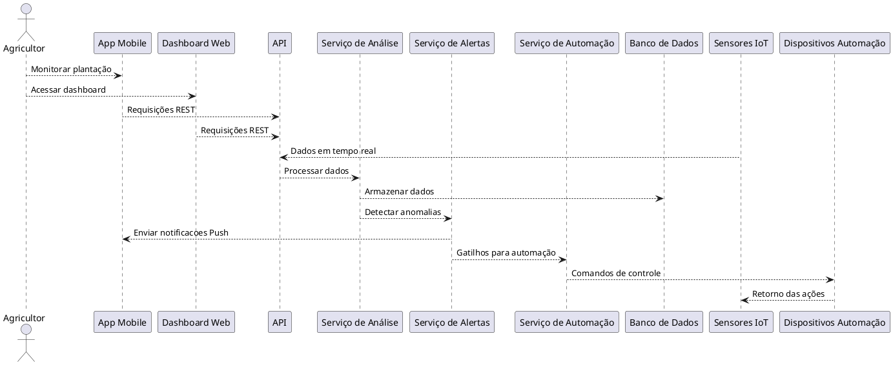
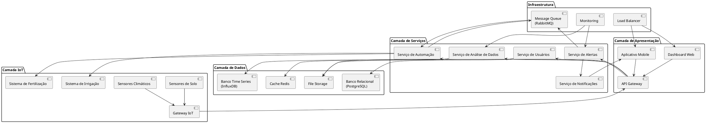
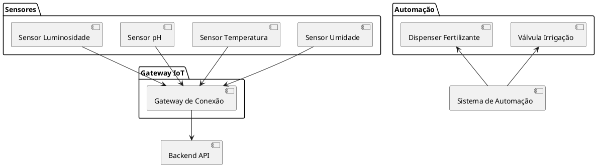

# Sistema de Monitoramento Agrícola IoT

## 1. Visão Geral do Sistema

### Propósito do sistema

O **Sistema de Monitoramento Agrícola IoT** consiste em uma plataforma tecnológica integrada que visa facilitar o manejo agrícola através da coleta, análise e automação baseada em dados obtidos através de sensores. 

O sistema deve combinar sensores distribuídos no campo, processamento inteligente de dados e interfaces para proporcionar aos agricultores controle total de suas plantações, de maneira a otimizar recursos e aumentar a produtividade.

---

### Principais funcionalidades

- **Análise Inteligente de Dados do Solo**  
O sistema coleta dados de sensores distribuídos estrategicamente pela plantação, medindo parâmetros como pH, umidade, nutrientes, temperatura, entre outros. Esses dados são processados por algoritmos de análise que permitem aos usuários tomar melhores decisões sobre o manejo.

- **Automação de Processos Agrícolas**  
Através dos dispositivos IoT conectados, o sistema automatiza processos críticos como irrigação, fertilização e monitoramento de colheitas.

- **Sistema de Alertas e Detecção de Anomalias**  
O sistema vai monitorar continuamente todos os parâmetros coletados e identificar automaticamente situações que requerem atenção. Alertas são enviados de maneira imediata por meio de canais.

- **Notificações Mobile em Tempo Real**  
Uma aplicação mobile permite que os usuários recebam notificações push sobre condições da plantação, incluindo alertas e status dos equipamentos, para informar o agricultor mesmo distante do campo.

- **Visualizações Interativas e Dashboards**  
O sistema oferece interfaces web e mobile com mapas interativos, gráficos dinâmicos e dashboards que exibem os dados coletados.

---

### Benefícios esperados

#### Aumento de produtividade e qualidade do cultivo:

- Otimização do uso de recursos
- Detecção de problemas que podem afetar a produção
- Automação de processos manuais
- Melhoria na qualidade dos cultivos

#### Economia de Recursos

- Redução do consumo de água
- Uso eficiente de fertilizantes
- Diminuição de custos operacionais através da automação
- Prevenção de perdas por detecção de problemas

#### Tomada de Decisão Baseada em Dados

- Acesso a dados históricos e tendências para guiar o planejamento
- Insights sobre condições futuras da plantação
- Relatórios detalhados para análise

#### Sustentabilidade Ambiental

- Redução do desperdício de recursos naturais
- Minimização do uso excessivo de químicos
- Monitoramento do impacto ambiental

---

### Escopo

**O que o Sistema FAZ:**

- Coleta dados de sensores distribuídos na plantação
- Processa e analisa dados em tempo real
- Gera alertas automáticos para situações críticas
- Controla dispositivos de irrigação e fertilização
- Fornece interfaces web e mobile para monitoramento
- Armazena histórico de dados para análise temporal
- Gera relatórios e visualizações interativas
- Envia notificações push para dispositivos móveis

**O que o Sistema NÃO FAZ:**

- Não substitui a supervisão humana
- Não inclui instalação dos sensores e equipamentos
- Não oferece consultoria especializada
- Não controla equipamentos de terceiros
- Não garante resultados de produtividade específicos
- Não inclui manutenção física dos dispositivos IoT

---

### Limitações Técnicas

- Depende de conectividade de rede para funcionamento
- Requer calibração dos sensores
- Performance limitada pela qualidade de dados dos sensores
- Cobertura limitada pela distribuição física dos sensores

## 2. Arquitetura de Sensores e IoT

### Tipos de Sensores:

- Umidade
- Temperatura
- pH do solo
- Luminosidade

---

### Dispositivos de Automação:

- Válvulas de irrigação
- Dispensadores de fertilizante

---

### Conectividade:

- WiFi
- LoRa
- Zigbee com gateways IoT

---

### Localização e Distribuição:

Distribuídos estrategicamente no campo para máxima cobertura.

---

## 3. Backend e Processamento

### Arquitetura de Dados

- Banco de Dados Relacional (PostgreSQL): Armazenar dados estruturados (usuários, dispositivos, logs de ações).
- Banco de Dados NoSQL (MongoDB ou InfluxDB): Armazenar grandes volumes de dados temporais dos sensores com alta taxa de escrita.
- Data Lake ou Armazenamento em Nuvem (AWS S3 / Azure Blob Storage): Arquivamento e análise histórica em larga escala.

---

### APIs e Microserviços

- Serviço de Sensoriamento: recebe e armazena dados dos sensores.
- Serviço de Análise de Dados: realiza o processamento e análise em batch ou em tempo real.
- Serviço de Alertas: identifica anomalias e dispara notificações.
- Serviço de Automação IoT: interage com dispositivos IoT para executar ações automatizadas.
- Serviço de Autenticação e Gerenciamento de Usuários: controle de acesso e identidade.
- Gateway de API: gerencia as requisições de entrada e direciona aos microserviços adequados.

—

### Sistema de Análise

- Análise Estatística: médias, desvio padrão, tendências.
- Detecção de Anomalias: com base em regras ou algoritmos de aprendizado de máquina (ex: Floresta de Isolamento).
- Módulo de Previsão (opcional): prever condições futuras da plantação com base em séries temporais.

Ferramentas como **Python com Pandas, Scikit-learn, TensorFlow** ou frameworks como **Apache Spark** podem ser utilizadas.

---

### Sistema de Alertas

Os alertas podem ser configurados com base em:

- Limiares (ex: temperatura > 40°C).
- Padrões anômalos identificados por IA.
- Falta de leitura dos sensores (possível falha).

As notificações podem ser enviadas por:

- Push notifications (via Firebase Cloud Messaging).
- E-mails ou SMS.
- Dashboards em tempo real.

---

### Tecnologias sugeridas

| Componente                     | Tecnologia Sugerida                          |
|-------------------------------|----------------------------------------------|
| Backend Principal             | Node.js, Python (FastAPI), Java (Spring Boot)|
| Banco Relacional              | PostgreSQL                                   |
| Banco de Dados Temporal       | InfluxDB, MongoDB                            |
| Mensageria IoT                | MQTT (Mosquitto), Kafka                      |
| APIs                          | RESTful APIs, WebSockets                     |
| Análise de Dados              | Python (Pandas, Scikit-learn), Apache Spark  |
| Orquestração de Serviços      | Docker, Kubernetes                           |
| Notificações Push             | Firebase Cloud Messaging (FCM)               |

---

## 4. Interface e Visualização

A interface do usuário (UI) e a visualização de dados são componentes críticos para o **Sistema de Monitoramento Agrícola IoT**, pois são o principal meio pelo qual os agricultores interagem e extraem valor da plataforma. A UI deve ser intuitiva, informativa e permitir ações rápidas e eficazes.

### Dashboard Web Principal

O **Dashboard Web Principal** é o ponto central de acesso para o usuário, oferecendo uma visão geral e consolidada do estado da plantação.

* **Propósito**: Fornecer um resumo visual e rápido das condições atuais da lavoura, alertas pendentes e atalhos para as funcionalidades mais importantes.
* **Conteúdo Chave**:
    * **Widgets de Status**: Exibição em tempo real dos principais parâmetros monitorados (ex: média de umidade do solo, temperatura ambiente, níveis de reservatórios de água/fertilizantes).
    * **Resumo de Alertas**: Notificações de anomalias recentes ou alertas críticos que exigem atenção imediata.
    * **Atalhos para Automação**: Acesso rápido para iniciar ou parar ciclos de irrigação ou fertilização.
    * **Mini-mapa da Propriedade**: Uma visão geral da localização dos sensores e status resumido por zona (se aplicável).
    * **Gráficos de Tendência Rápida**: Pequenos gráficos mostrando a evolução recente de 1-2 indicadores chave (ex: umidade nas últimas 24h).
* **Qualidades**:
    * **Clareza**: Informações apresentadas de forma direta e fácil de entender.
    * **Priorização**: Destaque para dados e alertas mais relevantes.
    * **Customização (Desejável)**: Possibilidade de o usuário personalizar quais widgets são exibidos ou sua ordem.

### Mapas e Geolocalização

A funcionalidade de mapas e geolocalização permite uma compreensão espacial dos dados coletados.

* **Propósito**: Visualizar a distribuição dos sensores no campo, as leituras de cada sensor em seu local exato e a variação espacial das condições da lavoura.
* **Funcionalidades**:
    * **Visualização de Sensores**: Ícones no mapa indicando a localização de cada sensor, com a possibilidade de clicar para ver dados detalhados.
    * **Heatmaps (Mapas de Calor)**: Representação visual da variação de parâmetros como umidade do solo, temperatura ou níveis de nutrientes em toda a área da plantação. Isso ajuda a identificar zonas com estresse hídrico, deficiência de nutrientes, etc.
    * **Delimitação de Zonas/Talhões**: Permitir que o usuário desenhe ou importe polígonos representando diferentes talhões ou zonas de manejo, facilitando a análise e controle granular.
    * **Navegação e Zoom**: Ferramentas padrão de mapa para fácil navegação.
* **Qualidades**:
    * **Precisão**: Representação fiel da localização dos dispositivos.
    * **Interatividade**: Resposta rápida a cliques e seleções, com tooltips informativos.
    * **Performance**: Carregamento eficiente mesmo com muitos pontos de dados ou grandes áreas.

### Gráficos e Relatórios

Gráficos e relatórios são essenciais para a análise de tendências, comparação de dados históricos e tomada de decisão baseada em evidências.

* **Propósito**: Transformar dados brutos dos sensores em insights acionáveis através de representações visuais e sumários estruturados.
* **Tipos de Gráficos**:
    * **Gráficos de Linha**: Para visualizar tendências temporais de dados contínuos (ex: temperatura ao longo da semana, umidade do solo ao longo do dia).
    * **Gráficos de Barra**: Para comparar valores entre diferentes sensores, zonas ou períodos (ex: consumo de água por talhão).
    * **Gráficos de Pizza/Rosca**: Para mostrar a proporção de diferentes categorias (ex: status dos dispositivos IoT - online, offline, com falha).
    * **Dispersão (Scatter Plots)**: Para identificar correlações entre duas variáveis (ex: luminosidade vs. temperatura).
* **Funcionalidades de Relatórios**:
    * **Relatórios Históricos**: Permitir a geração de relatórios para períodos selecionados (diário, semanal, mensal, personalizado).
    * **Relatórios de Consumo**: Detalhamento do uso de água e fertilizantes.
    * **Relatórios de Alertas**: Histórico de todos os alertas gerados, com detalhes de causa e tempo de resolução.
    * **Exportação**: Possibilidade de exportar gráficos (como imagem) e dados de relatórios (CSV, PDF).
* **Qualidades**:
    * **Interatividade**: Filtros dinâmicos, zoom em gráficos, tooltips com valores exatos.
    * **Legibilidade**: Eixos claros, legendas descritivas, cores contrastantes.
    * **Customização**: Capacidade de selecionar quais dados incluir nos relatórios e gráficos.

### Interface de Controle

A interface de controle permite que os usuários gerenciem ativamente os dispositivos de automação e as configurações do sistema.

* **Propósito**: Dar ao agricultor o comando sobre as operações automatizadas e as configurações dos dispositivos e alertas.
* **Funcionalidades**:
    * **Controle de Atuadores**: Botões e seletores para ligar/desligar válvulas de irrigação, ajustar dispensadores de fertilizantes.
    * **Agendamento de Tarefas**: Interface para programar ciclos de irrigação/fertilização (ex: irrigar a Zona A por 30 minutos todos os dias às 6h).
    * **Configuração de Limiares de Alerta**: Permitir que o usuário defina ou ajuste os limiares para os alertas (ex: alertar se a umidade do solo < 30%).
    * **Gerenciamento de Dispositivos**: Visualizar status dos dispositivos IoT (bateria, conectividade), adicionar novos dispositivos ou editar configurações dos existentes.
* **Qualidades**:
    * **Feedback Imediato**: Confirmação visual clara de que um comando foi enviado e/ou executado.
    * **Segurança**: Confirmação para ações críticas (ex: "Tem certeza que deseja iniciar a irrigação em toda a fazenda?").
    * **Intuitividade**: Ações de controle devem ser fáceis de encontrar e entender.

### Responsividade

A interface deve ser acessível e funcional em uma variedade de dispositivos e tamanhos de tela.

* **Propósito**: Garantir uma boa experiência do usuário tanto em desktops (para análise detalhada e configuração) quanto em dispositivos móveis como tablets e smartphones (para monitoramento em campo e ações rápidas).
* **Considerações**:
    * **Layout Fluido**: Elementos da interface se reorganizam e redimensionam de acordo com o tamanho da tela.
    * **Design Mobile-First (Recomendado)**: Projetar primeiro para telas menores pode ajudar a focar no essencial, expandindo para telas maiores.
    * **Touch-Friendly**: Em dispositivos móveis, botões e elementos interativos devem ser grandes o suficiente para fácil interação por toque.
* **Qualidades**:
    * **Consistência**: Experiência de usuário similar em diferentes dispositivos.
    * **Acessibilidade**: Navegação e leitura fáceis em qualquer tela.
    * **Performance**: Carregamento rápido mesmo em conexões móveis mais lentas.

### Tecnologias Sugeridas

Para o desenvolvimento da camada de interface e visualização, as seguintes tecnologias são recomendadas:

| Categoria                         | Tecnologia/Biblioteca        | Descrição                                                                                                |
| --------------------------------- | ---------------------------- | -------------------------------------------------------------------------------------------------------- |
| **Frontend Frameworks/Bibliotecas** | React.js                     | Ecossistema robusto, grande comunidade, ideal para SPAs complexas e dashboards interativos.                |
|                                   | Angular                      | Framework completo, opinativo, bom para aplicações enterprise com estrutura bem definida.                  |
|                                   | Vue.js                       | Curva de aprendizado mais suave, progressivo, bom para integrar em projetos existentes ou para dashboards mais simples. |
| **Bibliotecas de Gráficos** | Chart.js                     | Simples de usar, boa variedade de gráficos básicos, leve.                                                 |
|                                   | D3.js                        | Altamente poderosa e flexível para visualizações de dados customizadas e complexas, mas com curva de aprendizado íngreme. |
|                                   | ECharts                      | Biblioteca de gráficos interativos rica em funcionalidades, originária da Baidu.                           |
|                                   | ApexCharts                   | Gráficos SVG modernos e interativos.                                                                       |
| **Bibliotecas de Mapas** | Leaflet                      | Leve, open-source, ótima para mapas interativos com tiles.                                                 |
|                                   | OpenLayers                   | Mais robusta e com mais funcionalidades que o Leaflet, também open-source.                                 |
|                                   | Mapbox GL JS                 | Renderização de alta performance, mapas customizáveis (requer chave de API e pode ter custos).             |
| **State Management (SPAs)** | Redux (com React)            | Gerenciamento de estado para aplicações React complexas.                                                     |
|                                   | Vuex (com Vue)               | Gerenciamento de estado para aplicações Vue complexas.                                                      |
|                                   | NgRx (com Angular)           | Gerenciamento de estado para aplicações Angular complexas, inspirado no Redux.                             |
| **UI Component Libraries** | Material-UI (para React)     | Componentes React que implementam o Material Design do Google.                                               |
|                                   | Ant Design (React/Vue/Angular) | Biblioteca de componentes de UI de nível empresarial com um conjunto rico de componentes.                 |
|                                   | Bootstrap                    | Framework popular para desenvolvimento de interfaces responsivas e mobile-first.                           |
| **Ferramentas de Build/Bundling** | Webpack                      | Empacotador de módulos poderoso e configurável para JavaScript.                                            |
|                                   | Vite                         | Ferramenta de build moderna que oferece um desenvolvimento mais rápido com Hot Module Replacement (HMR) nativo. |

**Decisões de Arquitetura para Interface e Visualização**:

1.  **API First**: A interface dependerá de uma API bem definida e robusta fornecida pelo backend para buscar dados e enviar comandos. O uso de RESTful APIs e WebSockets é mencionado no documento e deve ser a base da comunicação.
2.  **Separação de Interesses**: Manter a lógica de apresentação (frontend) separada da lógica de negócios (backend).
3.  **Componentização**: Construir a UI usando componentes reutilizáveis para facilitar a manutenção e o desenvolvimento.
4.  **Performance**: Otimizar o carregamento de dados e a renderização das visualizações, especialmente para mapas e gráficos com grandes volumes de dados. Considerar paginação, carregamento preguiçoso (lazy loading) e virtualização de listas/tabelas.
5.  **Experiência do Usuário (UX)**: Priorizar um design centrado no usuário, com fluxos de trabalho intuitivos e feedback claro. Realizar testes de usabilidade é recomendado.
6.  **Atualizações em Tempo Real**: Para dados críticos e alertas, utilizar WebSockets ou Server-Sent Events (SSE) para atualizações em tempo real sem a necessidade de polling constante, conforme sugerido pelas tecnologias de API.

## 5\. Sistema Mobile e Notificações  

### Aplicativo Mobile  

O aplicativo mobile é a principal interface para agricultores monitorarem e controlarem suas plantações remotamente. Ele complementa o dashboard web, oferecendo funcionalidades essenciais em tempo real, mesmo quando o usuário está no campo.

**Principais Funcionalidades:**  
- **Monitoramento em Tempo Real:** Visualizar dados de sensores (umidade, temperatura, pH) em gráficos simplificados  
- **Controle de Automação:** Ligar/desligar sistemas de irrigação e fertilização manualmente via botões no app  
- **Mapa Interativo:**  
  - Visualizar a localização dos sensores e status por zona  
  - Cores indicando áreas secas/úmidas  
- **Modo Offline:**  
  - Armazenar dados localmente por 24h  
  - Sincronização automática ao restabelecer conexão  
- **Relatórios Rápidos:**  
  - Acesso a resumos diários de consumo de água  
  - Histórico de alertas recentes  

---

### Sistema de Notificações Push  

**Funcionalidades-Chave:**  
- **Tipos de Notificações:**  
  - Alertas Críticos (ex: "Temperatura acima de 45°C na Zona B!")  
  - Status de Dispositivos (bateria fraca/falhas de conexão)  
  - Confirmação de Ações (ex: "Irrigação iniciada com sucesso")  
- **Personalização:**  
  - Silenciar notificações não críticas  
  - Configurar horários de não perturbação (ex: 22h às 6h)  
- **Tecnologia:**  
  - `Firebase Cloud Messaging (FCM)` para Android/iOS  
  - Atualizações via `WebSockets` em tempo real  

---

### Integração com Backend  

**Fluxo de Comunicação:**  
- **Autenticação:**  
  - Tokens JWT via API Gateway  
- **APIs Principais:**  
  - `GET /sensors/current` - Dados atualizados dos sensores (JSON)  
  - `POST /automation/trigger` - Envio de comandos para atuadores  
  - `GET /alerts/history` - Histórico de alertas com filtros  
- **Sincronização de Dados:**  
  - Armazenamento local com `SQLite`  
  - Estratégia de `optimistic UI` para redução de latência  

---

### Funcionalidades Específicas Mobile  

**Exclusivas do App:**  
- **Geofencing:**  
  - Alertas automáticos ao entrar/sair de áreas monitoradas  
- **Upload de Fotos:**  
  - Anexar imagens a alertas (ex: fotos de pragas)  
- **Controle por Voz:**  
  - Integração com Google Assistant/Siri (ex: "Iniciar irrigação na Zona 1")  
- **Integração Bluetooth:**  
  - Conexão direta com dispositivos IoT próximos  

---

### Experiência do Usuário  

**Princípios de Design:**  
- **Priorização de Informações:**  
  - Dados críticos (alertas, umidade) no topo das telas  
- **Navegação Simplificada:**  
  - Menu inferior com 3 abas: "Monitorar", "Controle", "Alertas"  
- **Feedback Visual Imediato:**  
  - Cores intuitivas (vermelho para alertas, verde para status OK)  
  - Vibração em notificações críticas  
- **Acessibilidade:**  
  - Modo alto contraste para daltonismo  
  - Compatibilidade com VoiceOver/TalkBack  

---

### Tecnologias sugeridas  

| Componente               | Tecnologia                    | Descrição                                                                                     |
|--------------------------|-------------------------------|-----------------------------------------------------------------------------------------------|
| Desenvolvimento          | React Native ou Flutter       | Frameworks para desenvolvimento multiplataforma com reuso de código entre Android e iOS       |
| Notificações Push        | Firebase Cloud Messaging (FCM)| Serviço da Google para envio eficiente de notificações em tempo real com alta escalabilidade  |
| Armazenamento Local      | SQLite                        | Banco de dados embarcado para armazenamento offline confiável e sincronização posterior       |
| Gerenciamento de Estado  | Redux ou MobX                 | Bibliotecas para controle previsível de estados complexos no aplicativo                      |
| Segurança                | OAuth2 + SSL Pinning          | Autenticação segura via tokens e prevenção de ataques MITM (Man-in-the-Middle)               |
| Mapas                    | Mapbox SDK Mobile             | SDK especializado para renderização de mapas interativos com alto desempenho em dispositivos  |
---

## 6. Diagramas Arquiteturais

### Diagrama de Arquitetura Geral

### Diagrama de Componentes

### Diagrama de Sensores e IoT

